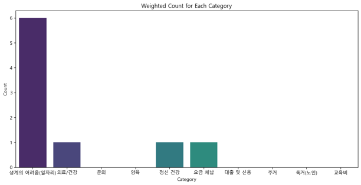
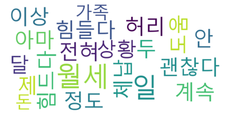
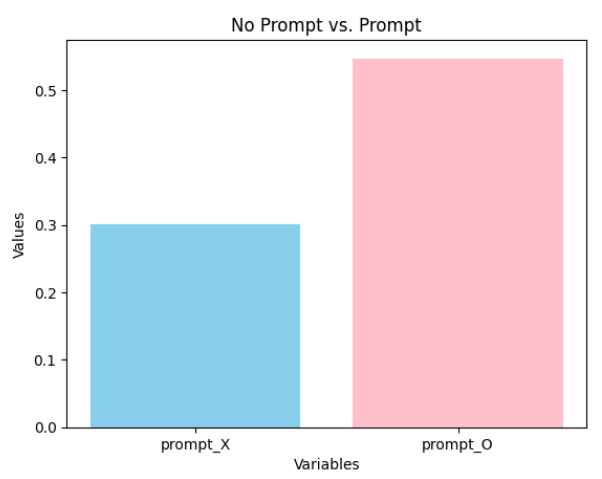
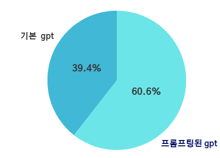

# AI 음성봇을 활용한 위기가구 발굴 상담시스템
(Consultation system scenario design and service implementation using AI voice bot)

## 🕒Development period
23.09.18 - 23.12.14

## 🖥️Subject

복지사각지대 발굴을 위한 전화상담을 자동화하고자 해당 **AI voicebot 위기가구 발굴 상담 시스템** 을 구축합니다.

현재, 복지사각지대 발굴 시스템의 구조는 복지 인력들이 직접 위기 가구로 판단이 되는 가구에게 전화를 걸어 복지 상담 및 위기 발굴을 하는 형태입니다. 

이미 존재하는 챗봇의 경우에도, 복지 사이트의 규칙 기반 챗봇을 통해 서비스를 신청하는 방식입니다.

이는 복지사각지대가 확대됨에 따라 인력 부족 문제 및 업무의 효율화에 대한 문제가 대두되고 있었습니다.

따라서, "AI 음성봇을 활용한 위기가구 발굴 상담시스템" 을 통해 해당 업무를 효율, 자동화하고자 합니다.

## 구성 모듈

#### 1. 음성인식 및 출력

해당 모듈에 있어서는 음성 인식과 STT, TTS를 활용하여 실제 상담사와 통화하는 것 같은 보이스 봇을 구성합니다.

#### 2. 복지 사각지대 발굴을 위한 질의응답 텍스트 생성 모듈

● 텍스트 생성에 적합한 언어모델인, GPT 모델과 프롬프트 엔지니어링을 활용하여 복지 사각지대에 있는 위기가구 발굴을 위한 질의응답 텍스트 생성 모듈을 개발합니다. 

● 기존 보건복지부 데이터베이스에 저장되어 있는 위기 가구로 추정되는 사람들에 대한 정보를 활용하여 해당 가구의 진위 여부(정말 위기 가구인지 아닌지)를 파악하고 필요한 지원을 제공할 수 있도록 자연스러운 대화를 진행하도록 합니다.

● 프롬프트는 필수조건과 부속조건을 설정하여, zero-shot learning, 조건 설정을 통해 구성했으며, 자유도 파라미터는 여러번의 대화 시나리오 생성 실험을 통해 0.3으로 설정했습니다.

#### 3. 위기가구 욕구 카테고리 분류 및 데이터 마이닝

저장된 상담 내용에 대한 텍스트 분석을 통해 대화에서 나온 키워드를 파악하고 이를 워드 클라우드로 나타내 상담 내용을 알기 쉽게 시각화합니다. 

또한, 의료/건강, 요금 체납 등 사전에 정해져 있는 카테고리에 관련이 있는 단어들을 분석하여 피상담자가 어떤 카테고리에 대한 욕구를 가지고 있는지를 분류합니다. 

분류 결과를 실제 상담사에게 전달함으로써 어느 카테고리로 분류되는 위기 가구인지에 대해 파악하는 시간을 절약할 수 있도록 합니다. 

   | 

## 생성 결과 평가
● 프롬프팅 여부에 대한 BLEU score 평가
</img>

● 프롬프팅 여부에 대한 human evaluation 평가
</img>

## 최종 웹 데모 구성

#### 위기가구 발굴을 위한 상담시스템 웹 데모 구현 결과
</img>
</img>

취약계층을 위한 AI음성챗봇 (위기가구용 데모 페이지)

복지상담사를 위한 위기가구 상담 결과 시각화 대시보드

### 전반적인 아키텍처
</img>

## 팀원

|이름|직책|담당|
|---------|--|---------|
|**김태경**| 팀장 | 텍스트 생성 모듈 개발 및 연결 |
|**주예서**| 팀원 | 텍스트 생성 모듈 개발 |
|**강민지**| 팀원 | 텍스트 마이닝 및 위험도 분석 |
|**이종우**| 팀원 | STT, TTS , 웹데모 구현|
