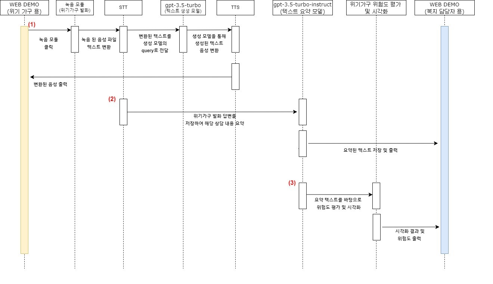

#AI 음성봇을 활용한 상담 시스템 시나리오 설계 및 서비스 구현 프로젝트
(Consultation system scenario design and service implementation using AI voice bot)

## 🕒Development period
23.09.18 - 23.12.14

## 🖥️Subject

### 전반적인 아키텍처
</img>

## 팀원

|이름|직책|담당|
|---------|--|---------|
|**김태경**| 팀장 | 텍스트 생성 모듈 개발 및 연결 |
|**주예서**| 팀원 | 텍스트 생성 모듈 개발 |
|**강민지**| 팀원 | 텍스트 마이닝 및 위험도 분석 |
|**이종우**| 팀원 | STT, TTS , 웹데모 구현|
